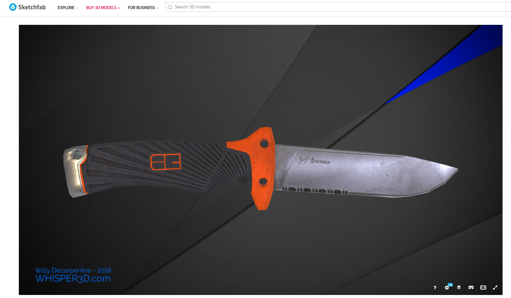
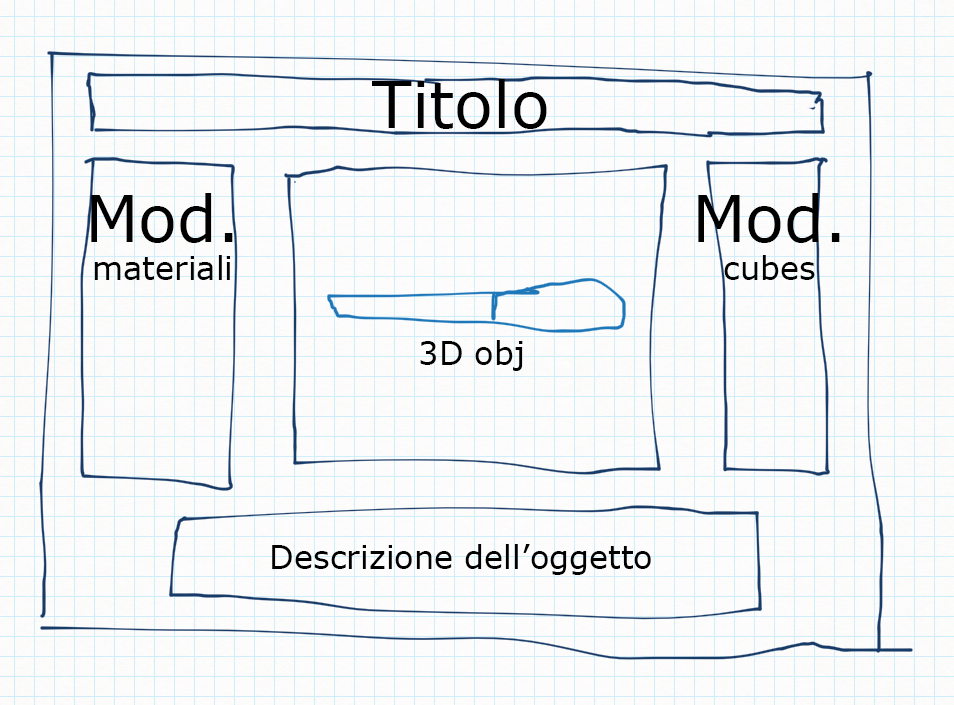
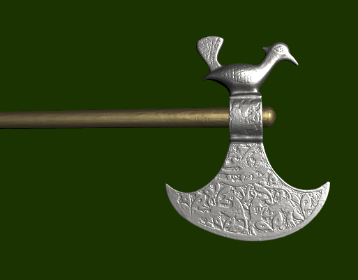
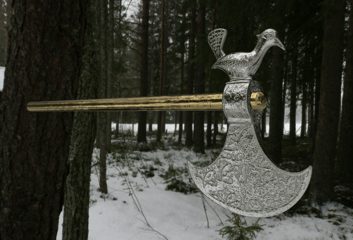
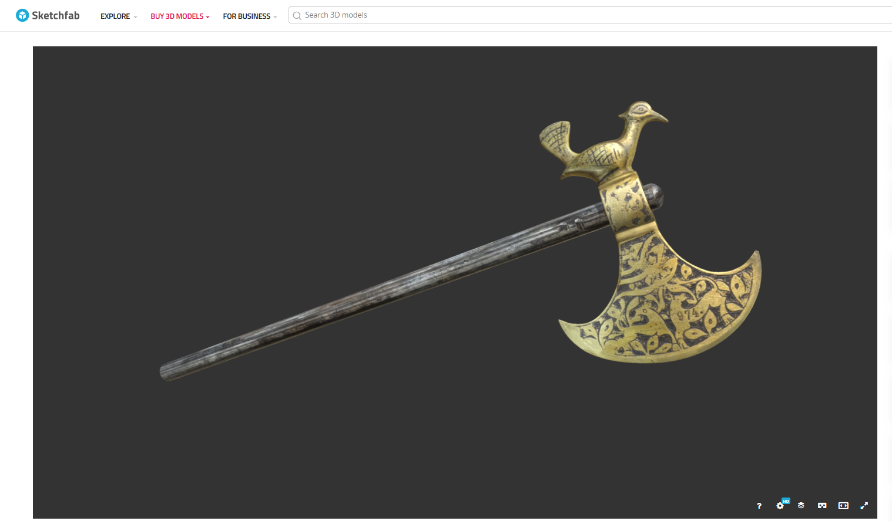
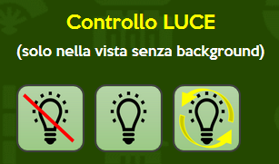
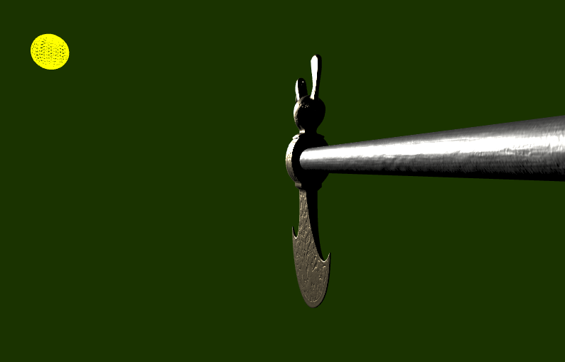
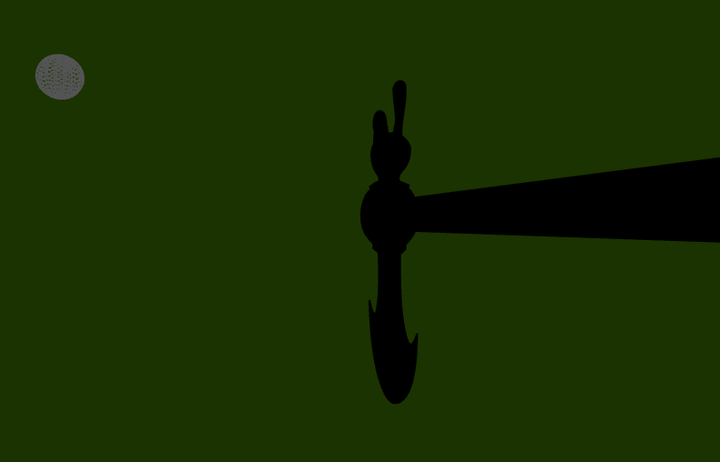

# JOURNAL del progetto di Interactive 3D Graphics:
Scafidi Roberto Antonino - Ziero Samuele - De Reggi Paolo

Progetto per il secondo parziale del corso di Interactive 3D Graphics (2018/2019) con consegna entro 17/06/2019.

Team:
Scafidi Roberto Antonino - 123125,
Ziero Samuele - 107201,
De Reggi Paolo - 123783.

## Idea generale e decisioni di design
L'idea di base è stata quella di progettare una pagina web per la pubblicizzazione di un ascia storica. Abbiamo costruito il sito in modo tale da presentare all'utente una pagina di un sito di e-commerce che permette l'acquisto dell'ascia sopra-descritta.
La pagina sarà caratterizzata da una struttura a colonne in cui la prima sarà usata per la modifica dei materiali, la seconda mostrerà l'oggetto tridimensionale e la terza permetterà la possibilità di cambiare sfondo (cubemap), oltre che attivare degli effetti di luce particolari.
Infine nella parte sottostante abbiamo deciso di inserire una descrizione dell'oggetto e il finto pulsante per l'acquisto.

## Progressi del progetto

**PARTENZA:** Siamo partiti pensando a come potessimo strutturare questo progetto: abbiamo pensato subito all'oggetto da rappresentare e dopo un brain storming abbiamo pensato di rappresentare un coltello: questo pechè un oggetto come un coltello è in generale costituito principalmente da 2 materiali: uno per la lama e uno per il manico, con proprietà diverse tra loro.

**PASSI DI SVILUPPO**
- Abbiamo scelto il modello a cui fare riferimento per il resto del progetto;

- Abbiamo deciso il tipo di struttura da applicare al sito e quindi come sarebbe dovuta essere la "forma" del sito;

- Abbiamo iniziato a implementare il sito, fino a decidere di riprogettare la pagina utilizzando un bootstrap per riuscire a lavorare in modo più efficiente in merito alla gestione delle larghezze della pagina e quindi renderla più responsive possibile;  

- Abbiamo iniziato l'implementazione attraverso l'inserimento degli shaders e l'applicazione delle texture;

- Abbiamo lavorato sulle cubemap e abbiamo studiato l'inserimento delle stesse nella scena, considerando anche l'opzione senza background;

- Abbiamo lavorato sui materiali e quindi sulla loro modificabilità e struttura;
- Abbiamo deciso di cambiare modello, quindi abbiamo ricalibrato l'intero progetto per la nuova sistemazione;

- Abbiamo rielaborato il sistema testando i doppi materiali;
- Abbiamo implementato la luce all'interno della scena attraverso dei controlli per il suo movimento e accensione/spegnimento;  

- Abbiamo aggiunto delle label che permettessero all'utente di visualizzare le scelte effettuate sui materiali;
- Abbiamo aggiunto una navigation bar per simulare più relaisticamente possibile, un sito di e-commerce;
- Abbiamo inserito altri tipi di materiali implementando le texture del legno
- Sistemazione codice finale e dettagli implementativi per la pulizia e l'efficienza dell'intera scena.

## Scelte di implementazione
- Abbiamo deciso di implementare la pagina web attraverso una struttura con bootstrap, cosi da gestire in modo ottimale gli spazi della schermata html.
- Abbiamo deciso di implementare un modello costituito da più materiali, così da poterli modificare e avere una scena più ricca di contenuti interattivi.
- Abbiamo deciso di poter rendere interattiva l'azione della luce sull'oggetto.

## Problemi riscontrati e soluzioni
- Abbiamo riscontrato inizialmente un problema di caricamento dell'oggetto 3D nella pagina in quanto il formato era sbagliato per threejs, risolvendo attraverso la scelta di un modello più appropriata;
- Abbiamo riscontrato un problema nel modello in quanto secondo le nostre scelte implementative, avevamo pensato di elaborare la scena attraverso la definizione diversa dei materiali all'interno del modello; questo ci ha portati al notare che il modello che avevamo scelto inizialmente (un coltello), era costituito da un solo materiale; Abbiamo dunque provato a suddividerlo in più mesh ma la soluzione ottenuta non soddisfava le nostre aspettative. Abbiamo deciso dunque di cambiare modello e utilizzarne uno strutturato in modo più complesso ma che ci permettesse di avere più libertà nella modifica della parti dell'oggetto in esame.
