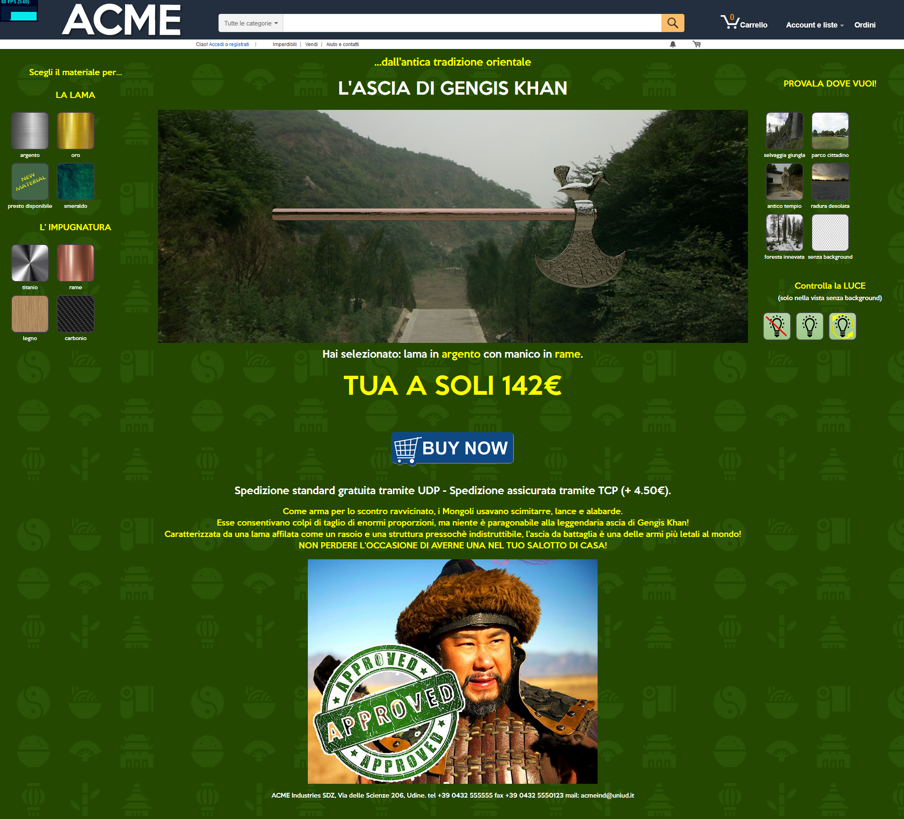
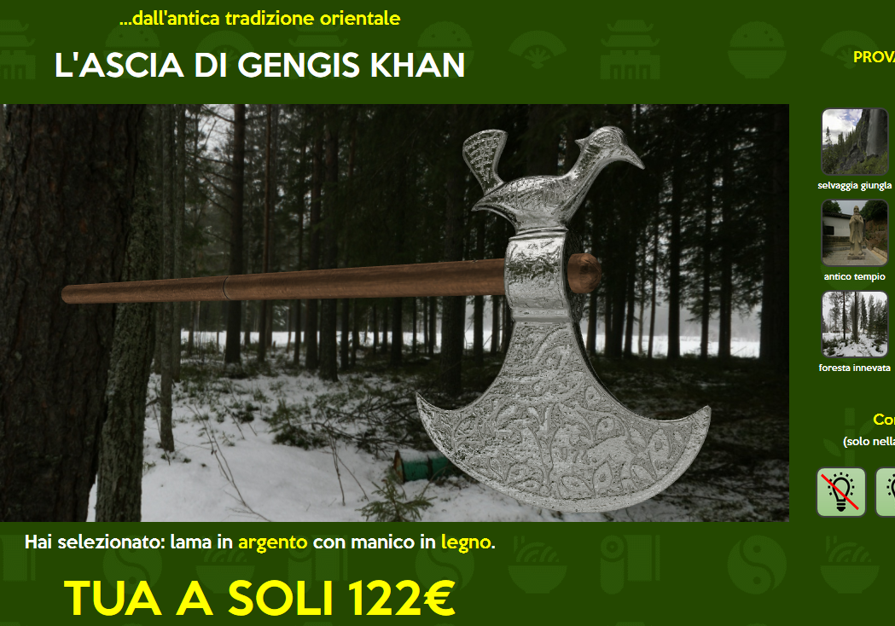
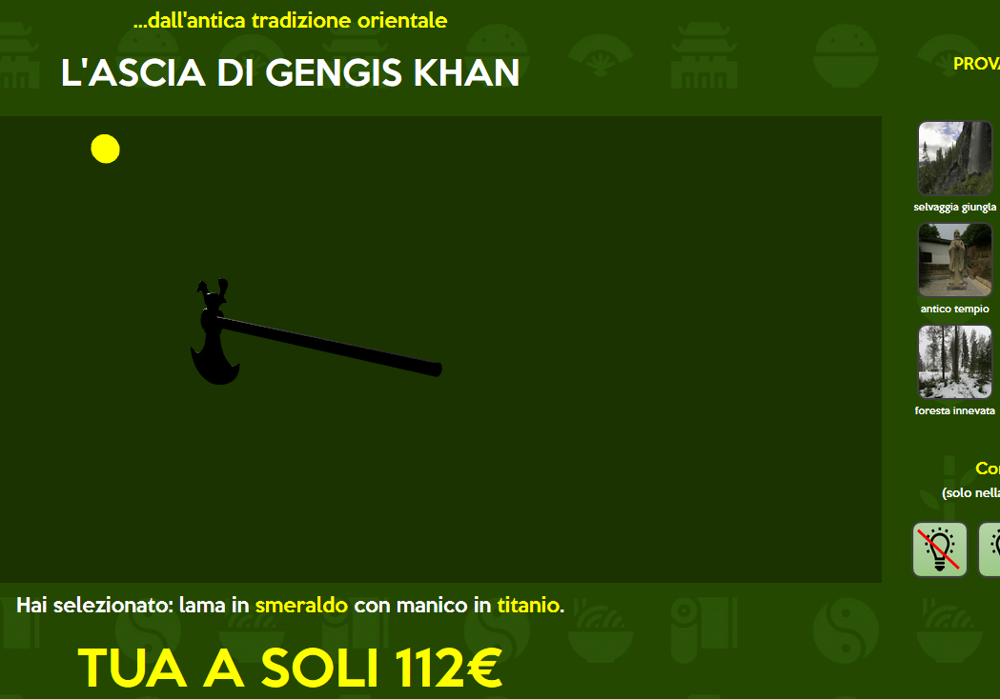

# GENGIS'S AXE

Progetto per il secondo parziale del corso di Interactive 3D Graphics (2018/2019) con consegna entro 17/06/2019.

Team:
- Scafidi Roberto Antonino - 123125,
- Ziero Samuele - 107201,
- De Reggi Paolo - 123783.

## Descrizione generale del progetto
Il progetto consiste in una applicazione web caratterizzata da un sito di e-commerce che permette l'acquisto di un'ascia da battaglia mongola (L'ascia di gengis khan). In particolare abbiamo sviluppato la possibilità di visualizzare il prodotto anche dopo aver modificato i suoi materiali, cosi da consentire al cliente una maggiore personalizzazione. Sarà quindi possibile variare il materiale dell'ascia, del manico e si potrà visualizzare l'oggetto nella sua interezza in vari ambienti, cosi da mostrare più precisamente possibile, come varia l'oggetto in situazioni differenti.

### Descrizione degli elementi
- **Scelta del materiale lama:** E' costituita dalla possibilità di scegliere tra argento, oro e ??;
- **Scelta del materiale del'asta:** E' costituita dalla possibilità di scegliere tra argento, oro e legno e ??
- **Scelta della cubemap:** E' costituit dalla possibilità di scegliere tra 5 ambienti diversi e una versione priva di background;
- **Comandi della luce:** Mini pannello per la gestione della luce nell'ambiente senza background che permette di visualizzare la fonte di luce e manovrarla;
- **Area di visualizzazione del modello:** Costituita da una scena attraverso il quale si può azionare la camera e visualizzare il modello con tutte le caratteristiche scelte.
- **Descrizione generica:** Parte sottostante alla pagina che descrive l'oggetto e simula più relisticamente possibile, un sito di e-commerce

### Modello e Texture
Per il modello abbiamo utilizzato una struttura già costruita (https://sketchfab.com/3d-models/decorative-battle-axe-71c096cafedd4aecb52f1f8eaccd5146), caratterizzata da un asta e la testa dell'ascia. L'ascia ha la forma di una mezzaluna. L'asta è semi rotonda, tappata con una piastra che usa canali longitudinali. Il lato smussato è decorato con la figura di un uccello. Entrambi i lati della testa dell'ascia sono decorati con ornamenti floreali con due figure stilizzate di animali.
La geometria del modello è caratterizzata da: 
- Quads: 5.7k
- Triangles: 20
- Polygon: 1
- converted to Triangles 11.3k
- Vertices: 6k
- Uploaded size: 23MB
### Shaders

## Screenshots del progetto
Intero sito web:

Esempio di cambio dei materiali in una diversa ambientazione:

Esempio di movimento della luce 

## Controllo Luci
Nella visualizzazione senza l'ambiente circostante, quindi senza cubemap, abbiamo implementato la possibilità di vedere come si comportano i materiali degli oggetti in presenza di una luce puntiforme, al netto di tutte le luci ambientali.  
Per attivare questo tipo di visualizzazione sono stati predisposti alcuni pulsanti nell'interfaccia del sito, con relative icone di:  
- attivazione della luce
- spegnimento della luce
- attivazione/disattivazione del movimento di rotazione della luce  

La luce, per semplicità, è stata simulata in maniera visuale da un oggetto di tipo Sphere, da cui si presuppone escano i raggi luminosi. Nella foto, infatti, è possibile visualizzare la sfera che irraggia la nostra ascia e il comportamento del materiale. La luce "accesa" è contraddistinta dal colore giallo della sfera.  
Ovviamente se "spegniamo la luce", azzerando la sua intensità, l'oggetto risulterà completamente al buio e la sfera sarà colorata di grigio.  

## Processo produttivo e planning steps

Per lo sviluppo del progetto abbiamo seguito un metodo Divide et Impera in cui le fasi principali sono state:
- Progettazione e design dell'idea;
- Decisione del modello di riferimento;
- Creazione di placeholder nel sito web per la struttura del progetto;
- Sostituizione man mano degli elementi fittizi con le versioni finali (scelta materiali, backgrounds, ecc.);
- Inserimento shaders, luci ed elementi principali della scena;
- Organizzazione generale degli elementi e perfezionamento dei dettagli;
- Inserimento dettagli del sito web per similarità ad un sito di e-commerce;
- Pulizia codice e organizzazione degli elementi;
- Creazione relazione del progetto.

## Credits
Per il progetto sono state utilizzate risorse tutte sotto licenza Creative Commons o utilizzabili senza fini commerciali, in particolare:
- il modello è stato preso dal sito web https://sketchfab.com/3d-models/decorative-battle-axe-71c096cafedd4aecb52f1f8eaccd5146
- i modelli delle cubemap dal sito web http://www.humus.name/index.php?page=Textures