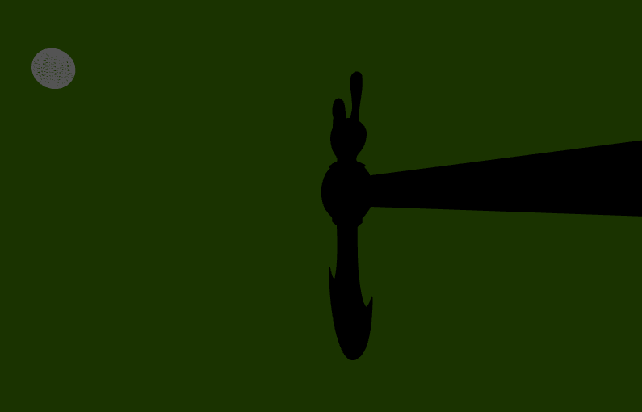

# GENGIS'S AXE

Progetto per il secondo parziale del corso di Interactive 3D Graphics (2018/2019) con consegna entro 17/06/2019.

Team:
- Scafidi Roberto Antonino - 123125,
- Ziero Samuele - 107201,
- De Reggi Paolo - 123783.

## Descrizione generale del progetto
Il progetto consiste in una applicazione web caratterizzata da u

### Descrizione degli elementi
- **Treno:** E' costituito da 6 blocchi 3D per la motrice e 6 per il vagone. E' costituito da 2 set di ruote posizionate al di sotto dei blocchi e da 8 cubi all'interno del vagone.

### Modello e Texture

### Shaders

## Screenshots del progetto

## Controllo Luci
Nella visualizzazione senza l'ambiente circostante, quindi senza cubemap, abbiamo implementato la possibilità di vedere come si comportano i materiali degli oggetti in presenza di una luce puntiforme, al netto di tutte le luci ambientali.  
Per attivare questo tipo di visualizzazione sono stati predisposti alcuni pulsanti nell'interfaccia del sito, con relative icone di:  
- attivazione della luce
- spegnimento della luce
- attivazione/disattivazione del movimento di rotazione della luce  

La luce, per semplicità, è stata simulata in maniera visuale da un oggetto di tipo Sphere, da cui si presuppone escano i raggi luminosi. Nella foto, infatti, è possibile visualizzare la sfera che irraggia la nostra ascia e il comportamento del materiale. La luce "accesa" è contraddistinta dal colore giallo della sfera.

Ovviamente se "spegniamo la luce", azzerando la sua intensità, l'oggetto risulterà completamente al buio e la sfera sarà colorata di grigio.

4. Build the application that renders the chosen 3D model, with the designed lighting setup and materials, and an user interface for selecting the material between the alternatives. **Important: you can implement this step in two different ways**:

    a. using three.js built-in lights and materials (MeshStandardMaterial or MeshPhysicalMaterial), without writing any shader. In this case, your final report **must include** the equations of the BRDF and rendering equations that you are using. In other words, you have to dig into three.js shaders to find which equations are used, and write them (in mathematical form, not using code);

    b. using shaders written by you, e.g. by extending the shaders we saw in the classroom. In this case, your report needs just to mention the kind of BRDF / lights you have implemented (no need to report the equations, unless you are using different BRDF or adding some new equation).

## Processo produttivo e planning steps

Per lo sviluppo del progetto abbiamo seguito un metodo Divide et Impera in cui le fasi principali sono state:
- Progettazione e design dell'idea;
- Creazione placeholder e definizione delle idee utilizzando three.js;
- Sostituizione man mano degli elementi fittizi con le versioni finali;
- Organizzazione generale degli elementi;
- Ottimizzazione delle leggi e calcolo efficienza del codice;
- Creazione della heatmap e fase di testing;
- Pulizia codice e organizzazione degli elementi;
- Creazione relazione del progetto.

## Credits
Per il progetto sono state utilizzate solo texture distribuite sotto licenza Creative Commons, (in particolare tutte provenienti dal sito https://freestocktextures.com) eventualmente rielaborate per massimizzare l'efficienza nel caricamento.
